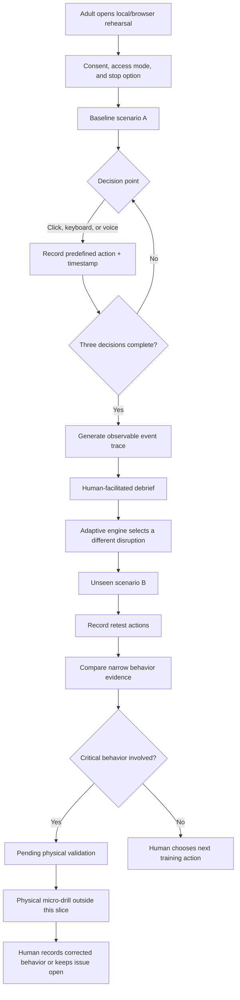

# Decisión Bajo Presión — Week 6 Product Packet

## Problem in my words

Emergency plans are usually taught as a fixed sequence: hear the alert, follow the route, reach the assembly point. The failure begins when that sequence stops working. A blocked exit, missing person, failed message, or conflicting sign forces an adult to interpret uncertainty and choose an action, yet ordinary compliance records mainly prove attendance or completion.

This slice attacks the team's **Behavior Measurement** vacuum. It creates a short, repeatable rehearsal that records narrow observable decisions, supports a human debrief, and then changes the situation for an unseen retest. It does not claim that a participant, school, or organization is prepared. For critical behaviors, the digital result remains pending until a human records a physical transfer test.

## Exact user

**Primary user:** A teacher or school-brigade member at a private school in Mexico City that already maintains a formal civil-protection program with a registered consultant.

The user is comfortable with a browser but is not a gamer. They have limited time between school responsibilities, may be using shared equipment, and need clear Spanish instructions. They must be able to pause without penalty and use mouse, keyboard, touch, or voice. A non-immersive alternative must remain available.

**Secondary actor:** The school's civil-protection consultant or safety lead, who facilitates the debrief, reviews aggregate evidence, and decides what must be tested physically.

## Success definition

Before the module closes, the adult user can:

1. Complete a three-decision baseline scenario in a browser-based 3D environment.
2. Review an event trace with a human facilitator that describes actions without assigning psychological traits or a generic preparedness score.
3. Face a different, unseen scenario selected from the baseline evidence and make the corresponding decisions by clicking or speaking.
4. See whether a previously missed narrow behavior was demonstrated in the retest.
5. See every critical result labeled **Pending physical validation**, with no digital control capable of declaring competence.

The slice succeeds technically when every decision is timestamped, the adaptive retest never repeats the exact baseline disruption, voice and click inputs produce the same decision event, the pause control works at every decision, and the final view clearly separates digital evidence from the human training decision.

## Image-generated mockup


The mockup was generated with an AI image tool and represents the target interaction, not the final implementation. It deliberately includes the labels **Escenario B — retest no visto**, **IA simulada — la decisión final es humana**, **Requiere prueba física**, and **Pausar y salir**.

## Feature flow



## Actor swimlane

```mermaid
sequenceDiagram
    actor Adult as Teacher / brigade member
    participant Sim as 3D browser simulation
    participant Voice as Voice interface
    participant Adaptive as Adaptive engine
    actor Lead as Human safety lead

    Adult->>Sim: Starts baseline and chooses an access mode
    Sim-->>Adult: Presents decision point and pause option
    Adult->>Voice: Speaks a bounded command (optional)
    Voice->>Sim: Sends the same validated decision event as a click
    Sim->>Adaptive: Sends predefined event sequence, no free-text profile
    Adaptive-->>Lead: Produces an observable event trace
    Lead->>Adult: Conducts debrief and reflection
    Adaptive->>Sim: Selects a different disruption using missed behavior
    Sim-->>Adult: Presents unseen retest
    Adult->>Sim: Completes retest decisions
    Sim-->>Lead: Shows comparison and pending physical validation
    Lead->>Lead: Decides next training step; system does not certify readiness
```

## Benchmark

**Best existing solution:** [FLAIM FTS with Capture](https://www.flaimsystems.com/firefighter-training) combines high-fidelity immersive emergency scenarios, performance recording, analytics, and structured after-action review for professional firefighting.

**How this differs/localizes:** Decisión Bajo Presión begins with a low-cost browser rehearsal for Mexican school adults, uses existing civil-protection consultants as facilitators, adapts a second unseen scenario to narrow decision evidence, provides a voice-access path, and requires a physical micro-drill before any critical issue can be closed.

## Long view — three-year light charter

In three years, the slice becomes a consultant-operated rehearsal library for Mexican schools and workplaces, with locally validated building patterns, accessible interaction modes, and comparable evidence across repeated training cycles. The platform helps human safety leads find which decision failures persist when conditions change and connect those failures to corrective actions and physical drills. It remains a training-decision system—not a fear engine, surveillance product, or automatic certification of safety.

## Scope cut

This week I am **not** building:

- A full digital twin of a real school or any geospatial evacuation certification.
- Headset-native VR or WebXR hardware support; the 3D browser simulation is explicitly labeled as a screen-based rehearsal.
- Crowd physics, earthquake physics, biometric stress detection, gaze tracking, emotion recognition, or fear-adaptive intensity.
- A general-purpose conversational AI or open-ended voice transcription stored on a server.
- Student accounts, parent consent management, school records, personal profiles, leaderboards, or permanent named readiness histories.
- Automatic competence, courage, panic, preparedness, survival, or mortality scores.
- A substitute for a legally required drill, consultant judgment, or physical validation.

## Architecture and stack

| Layer | Free technology | What it does | Why it is multiplicative |
|---|---|---|---|
| Interface | React + TypeScript + Vite | Accessible Spanish UI, session controls, evidence views | Connects every simulation and evidence state in one testable browser flow |
| Simulation / 3D | Three.js through React Three Fiber | Presents bounded school-corridor decisions, blocked routes, signs, and changed conditions | The adaptive engine alters the next 3D disruption rather than merely adding a separate dashboard |
| Adaptive logic | Transparent local decision-policy model | Uses missed observable behavior from scenario A to select a different scenario-B disruption and comparison rule | Changes what the user rehearses next; it never infers emotion or personality |
| Voice | Browser Web Speech API with a validated command grammar | Accepts bounded Spanish commands such as “ruta alterna,” “pedir apoyo,” and “pausar” | Voice commands trigger the same logged 3D events and allow hands-free/accessibility testing |
| Evidence | In-memory typed event log | Stores scenario version, action code, relative timestamp, input mode, and observable outcome | Feeds the adaptive retest and human debrief without storing personal data |
| Testing | Vitest + Testing Library + Playwright | Verifies decision rules, event traces, interaction parity, and critical labels | Tests the whole loop rather than the layers independently |
| Deployment | Static Vercel deployment | Serves the browser module without secrets or a database | Keeps the working slice cheap, reproducible, and deployable twice during the test-fix cycle |

## Adaptive policy

The product uses an interpretable adaptive policy rather than claiming a trained predictive model. Each baseline choice maps to a narrow behavior code such as `checks_route_status`, `maintains_accountability`, or `requests_assistance`. The selector chooses an unseen scenario whose surface details differ but whose decision requires the missed behavior. If no target behavior was missed, it selects a deterministic alternate scenario that introduces conflicting information and tests whether the successful behavior transfers.

The comparison reports only one of three statements:

- **Demonstrated in both simulations**
- **Demonstrated after debrief in the unseen retest**
- **Not yet demonstrated — requires more rehearsal**

All critical behaviors additionally display **Pending physical validation**. These labels are simulated decision support for a human facilitator, not competence judgments.

## Security and ethics floor

- No API key, secret, database, or external AI service is required by the working slice.
- No personal information is collected; the demo uses an invented session identifier and clears on refresh.
- Spoken commands use the browser interface and are converted only into allow-listed action codes; raw audio and transcripts are not stored.
- Every command and optional facilitator note has a strict allow list or length limit.
- The interface labels adaptive output as **Simulated AI — final decision is human**.
- Users can pause or exit at every decision without penalty and can use click/keyboard instead of voice.
- No personalized trauma, recognizable victims, cloned voices, graphic harm, hidden manipulation, or fear-adaptive intensity appears.
- Aggregate or anonymous event evidence supports the consultant; it does not replace professional judgment.

## Test plan

### Mechanical pass

1. Run unit tests for scenario selection, behavior comparison, and the rule that critical outcomes always remain pending physical validation.
2. Run component tests confirming click, keyboard, and voice-command events create the same validated action code.
3. Confirm scenario B has a different identifier and disruption from scenario A.
4. Confirm a user can pause and exit at every decision point without receiving a failure label.
5. Confirm the evidence trace contains only allowed fields and never contains a readiness or psychological score.
6. Run an automated browser journey at desktop and mobile widths.
7. Use only invented demo data and scan the repository for likely secret patterns.
8. Record at least one discovered bug, fix it, rerun the suite, and document the before/after behavior before the second deployment.

### Persona pass

Synthetic user: **Laura Hernández, 47, a primary-school teacher and brigade volunteer in CDMX.** She uses WhatsApp and school platforms but has never played a 3D game, reads instructions carefully, dislikes being judged by software, and may abandon a tool if she cannot tell whether a button records a final answer. She has mild motion sensitivity and prefers keyboard or voice controls when precise mouse movement is difficult.

Show Laura every screen in order in a fresh conversation and ask her to attempt the task in character while narrating hesitation, confusion, and reasons she would quit. Log every issue, rank by severity, fix the worst issue, and repeat the affected screens. Specifically test whether she understands the difference between digital improvement and physical validation, whether she notices the pause option, and whether the 3D movement causes discomfort.

## Blueprint conditions traceability

| Blueprint condition | How this slice honors it |
|---|---|
| Narrow observable actions only | The log stores allow-listed decisions and timestamps, never psychological or survival scores |
| Human debrief + physical transfer | A facilitated debrief precedes the retest; critical results remain pending a physical micro-drill |
| Start operationally small | One adult, two short browser scenarios, three decisions each, no headset required |
| Fit Mexican civil protection | The secondary actor is an existing consultant or safety lead, not an automated replacement |
| Shadow clause | No personalized trauma, cloned voices, recognizable victims, fear adaptation, or permanent named profile |
| Failures remain visible | An unresolved critical behavior cannot be converted into completion or competence by the digital module |

