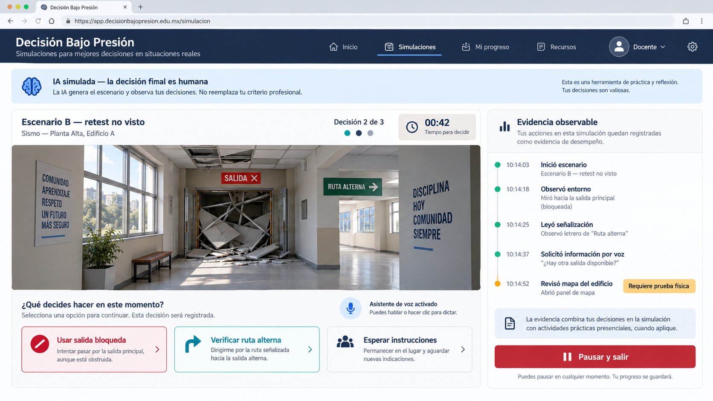
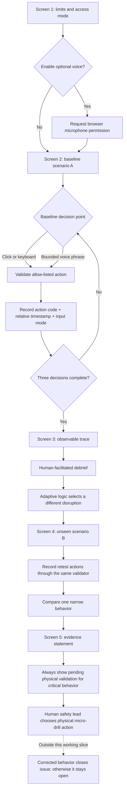
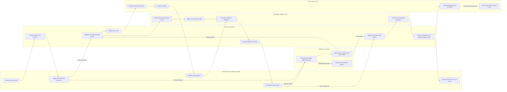
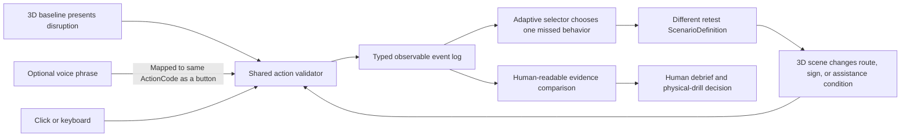

# Decisión Bajo Presión — Week 6 Product Packet

## Declared vacuum

**The MEASUREMENT vacuum — zero data on whether drills change behavior.**

The working slice measures whether one narrowly defined decision behavior transfers from a baseline rehearsal to a different, unseen scenario. Compliance-Upgrade remains a possible route to market through existing civil-protection budgets, but it is not the primary vacuum. The Family and Insurance-Bridge vacuums are outside this week's slice.

## Problem in my words

Emergency plans are usually taught as a fixed sequence: hear the alert, follow the route, reach the assembly point. The failure begins when that sequence stops working. A blocked exit, missing person, failed message, or conflicting sign forces an adult to interpret uncertainty and choose an action, yet ordinary compliance records mainly prove attendance or completion.

This slice attacks **The MEASUREMENT vacuum**: there is almost no useful evidence showing whether emergency drills change behavior. The team's specific interpretation is behavior measurement. The product creates a short, repeatable rehearsal that records narrow observable decisions, supports a human debrief, and then changes the situation for an unseen retest. It does not claim that a participant, school, or organization is prepared. For critical behaviors, the digital result remains pending until a human records a physical transfer test.

## Exact user

**Primary user:** A teacher or school-brigade member at a private school in Mexico City that already maintains a formal civil-protection program with a registered consultant.

The user is comfortable with a browser but is not a gamer. They have limited time between school responsibilities, may be using shared equipment, and need clear Spanish instructions. They must be able to pause without penalty and use mouse, keyboard, touch, or voice. A non-immersive alternative must remain available.

**Secondary actor:** The school's civil-protection consultant or safety lead, who facilitates the debrief, reviews aggregate evidence, and decides what must be tested physically.

## Success definition

Before the module closes, the adult user can:

1. Complete a three-decision baseline scenario in a browser-based 3D environment.
2. Review an event trace with a human facilitator that describes actions without assigning psychological traits or a generic preparedness score.
3. Face a different, unseen scenario selected from the baseline evidence and make the corresponding decisions by clicking or speaking.
4. See whether a previously missed narrow behavior was demonstrated in the retest.
5. See every critical result labeled **Pending physical validation**, with no digital control capable of declaring competence.

The slice succeeds technically when every decision is timestamped, the adaptive retest never repeats the exact baseline disruption, voice and click inputs produce the same decision event, the pause control works at every decision, and the final view clearly separates digital evidence from the human training decision.

## The working slice — screen by screen

The slice is one short adult rehearsal lasting approximately six to eight minutes. It contains five screens and no account creation.

### Screen 1 — Before you begin

The user sees three limits before entering the simulation:

- This is a **screen-based 3D rehearsal**, not virtual reality and not a prediction of real-world safety.
- The module records predefined decisions and relative timestamps, not identity, emotion, courage, panic, or biometric information.
- The user can pause or leave without penalty and can complete the full module without voice input.

The user selects normal or reduced motion and may explicitly enable bounded Spanish voice commands. Voice permission is not requested until the user chooses it.

### Screen 2 — Baseline scenario A

The 3D scene shows a generic Mexican school corridor. It is not a digital twin of a real building. The adult encounters three decision points:

1. **The alert begins:** observe the environment and follow the school's current instruction, move immediately without checking conditions, or continue the previous activity.
2. **The primary exit is blocked:** verify and use the marked alternate route, attempt the obstructed route, or wait without communicating.
3. **An assigned person is not accounted for:** report the missing status and request coordinated support, leave the group to search alone, or close the count without reporting the discrepancy.

Each choice changes the visible 3D state and records only an allow-listed action code, scenario version, relative timestamp, and input mode. The simulation does not call these choices proof of competence. Scenario details and final option wording must be validated by a Mexican civil-protection professional before use outside the classroom prototype.

### Screen 3 — Observable trace and human debrief

The user and human facilitator see a chronological trace such as:

- `00:18 — Observed the route sign`
- `00:31 — Selected the blocked primary exit`
- `00:47 — Reported an accountability discrepancy`

The adaptive system highlights one narrow behavior for the retest, such as `checks_route_status`, but it does not assign a preparedness score or reveal the correct response to the next scenario. The user must confirm that a human debrief occurred before continuing.

### Screen 4 — Unseen scenario B

The system selects a different disruption based on the missed or weakest observable behavior from scenario A:

| Baseline evidence | Different retest disruption | Behavior tested again |
|---|---|---|
| Attempted a blocked exit | The normal alternate stairwell is closed and a temporary route sign appears | `checks_route_status` |
| Lost accountability | A participant is missing after the group changes assembly area | `maintains_accountability` |
| Abandoned or ignored an assistance assignment | The assigned person cannot use the newly selected route | `requests_assistance` |
| No target behavior missed | Two signs conflict after a route change | `verifies_information` |

The user again chooses by button, keyboard, or an allow-listed voice command. Scenario B never repeats scenario A's exact layout or disruption.

### Screen 5 — Comparison and next action

The final screen reports only one evidence statement for the targeted behavior:

- **Demonstrated in both simulations**
- **Demonstrated after the debrief in the unseen retest**
- **Not yet demonstrated — requires more rehearsal**

For every critical behavior, the screen also shows **Pending physical validation**. It directs the human safety lead to test the behavior during the school's physical micro-drill. There is no button that marks the participant competent, the school prepared, or the issue closed.

## Bounded voice grammar

Voice is an optional control method, not an open-ended assistant. The first build recognizes only a small Spanish grammar mapped to the same action codes as the buttons:

- `ruta alterna`
- `reportar persona`
- `pedir apoyo`
- `esperar instrucción`
- `pausar`

Unrecognized speech is discarded immediately and produces a neutral message asking the user to select a visible option. Raw audio and transcripts are never stored.

## Image-generated mockup



The mockup represents **Screen 4 — Unseen scenario B**. It was generated with an AI image tool and represents the target interaction, not the final implementation. It deliberately includes the labels **Escenario B — retest no visto**, **IA simulada — la decisión final es humana**, **Requiere prueba física**, and **Pausar y salir**. The final coded interface may simplify the visual scene, but it must preserve this information hierarchy, the neutral tone, and the permanent exit control.

## Feature flow



## Actor swimlane



## Benchmark

**The best existing solution on Earth for this is:** [FLAIM FTS with FLAIM Capture](https://www.flaimsystems.com/flaim-capture), which connects immersive emergency scenarios to performance recording, analytics, and data-informed after-action review for professional responders.

**Mine differs or localizes by:** Decisión Bajo Presión brings the rehearse-record-debrief loop into the existing [CDMX school civil-protection program and Responsable Oficial workflow](https://www.proteccioncivil.cdmx.gob.mx/secretaria/marco-normativo), begins with an accessible browser simulation, tests transfer through a different unseen scenario, and keeps critical findings open until a human-led physical drill validates the behavior.

## Long view — three-year light charter

In three years, Decisión Bajo Presión becomes a consultant-operated rehearsal library for Mexican schools and workplaces, with locally validated scenarios, accessible interaction modes, and comparable evidence across repeated training cycles. Organizations use it to see whether narrow decision behaviors transfer across unseen simulations and physical drills, while unresolved failures flow to a responsible owner, corrective action, and closure test. It remains human-led training infrastructure—not a fear engine, surveillance product, or automatic certification of safety.

## Scope cut

This week I am deliberately **not** building:

- **Headset VR or WebXR:** the required simulation layer is one lightweight browser-based 3D corridor, explicitly labeled as a screen-based rehearsal.
- **A digital twin or certified route map:** the scene is generic and cannot validate a real building, evacuation route, or regulatory plan.
- **A trained predictive model:** the “AI” layer is transparent adaptive logic that chooses an unseen retest from allow-listed behavior evidence; it does not predict real-world performance.
- **A backend or institutional platform:** there are no accounts, authentication, database, dashboards across schools, permanent profiles, or cloud-stored voice transcripts.
- **Student, family, insurer, or parent workflows:** the only participant is an adult teacher or brigade member, and the only secondary actor is a human safety lead.
- **Realistic disaster physics:** there is no crowd simulation, structural model, earthquake model, biometric stress measurement, gaze tracking, emotion recognition, or fear-adaptive intensity.
- **Open-ended conversational AI:** voice recognizes only the small command grammar listed above and discards anything it cannot map safely.
- **Compliance or competence certification:** the prototype cannot approve a civil-protection program, replace a required drill, close a critical finding, or declare a person or school prepared.
- **The physical drill itself:** the final screen creates the human next action and preserves the open issue; actual transfer testing and closure happen outside this working slice.

## Architecture and stack

The working slice is a client-only single-page application. It has no backend, account system, database, analytics service, or external AI API. [Vite's static-deployment guidance](https://vite.dev/guide/static-deploy) supports direct Git-based deployment to Vercel, where the default production build is generated in `dist`.

| Module | Free technology | Contract and responsibility |
|---|---|---|
| Application shell | React + TypeScript + Vite | Owns the explicit session phases: `intro`, `baseline`, `debrief`, `retest`, `comparison`, and `paused`; renders Spanish UI and accessibility controls |
| 3D scene | Three.js through [React Three Fiber](https://r3f.docs.pmnd.rs/getting-started/introduction) | Receives a typed `ScenarioDefinition`, renders only lightweight geometry, signs, and route state, and emits a selected option; it contains no scoring logic |
| Non-3D equivalent | Semantic React controls | Presents the same decision options and produces the same action codes when WebGL is unavailable, reduced motion is selected, or the user prefers a flat view |
| Action validator | Pure TypeScript module | Accepts only known `DecisionId`, `ActionCode`, and `InputMode` values; click, keyboard, and recognized speech must all pass through this one validator |
| In-memory event log | Pure TypeScript reducer | Appends only `scenarioId`, `decisionId`, `actionCode`, `relativeTimeMs`, and `inputMode`; clears on reload and never stores names, raw speech, free text, or psychological labels |
| Adaptive selector | Pure deterministic TypeScript function | Reads baseline action codes, chooses one behavior target, and returns a different allow-listed retest scenario; it never predicts real-world performance |
| Voice adapter | Optional [Web Speech API `SpeechRecognition`](https://developer.mozilla.org/en-US/docs/Web/API/SpeechRecognition) adapter | Converts a recognized phrase into an allow-listed action code, then immediately discards the phrase; failure or unsupported browsers fall back to visible controls |
| Evidence comparison | Pure TypeScript function | Produces one of the three approved evidence statements plus an immutable physical-validation requirement for critical behaviors |
| Test harness | Vitest + React Testing Library + Playwright | Tests domain logic, interaction parity, accessibility paths, and the full browser flow |
| Deployment | GitHub + Vercel static deployment | Creates a first public deployment before testing and a second verified deployment after the documented bug fix |

### Core data contracts

```ts
type SessionPhase =
  | "intro"
  | "baseline"
  | "debrief"
  | "retest"
  | "comparison"
  | "paused";

type InputMode = "pointer" | "keyboard" | "voice";

type DecisionEvent = {
  scenarioId: string;
  decisionId: string;
  actionCode: string;
  relativeTimeMs: number;
  inputMode: InputMode;
};

type ComparisonResult = {
  behaviorCode: string;
  evidenceStatement:
    | "demonstrated_both"
    | "demonstrated_after_debrief"
    | "not_yet_demonstrated";
  physicalValidation: "pending";
};
```

Names, emails, school identifiers, raw audio, transcripts, absolute timestamps, location, biometrics, emotion labels, and readiness scores are forbidden fields.

## Multiplicative Dragon Stack

The stack is **simulation/3D + adaptive logic + voice**. It is multiplicative because the three layers alter one shared rehearsal-and-evidence loop rather than appearing as unrelated demonstrations.



- **3D is load-bearing:** it makes a route obstruction or changed assistance condition visible and stateful; removing it eliminates the simulated disruption.
- **Adaptive logic is load-bearing:** baseline evidence selects which different scenario definition the 3D scene renders next; removing it turns the retest into a fixed quiz.
- **Voice is connected, not decorative:** a recognized bounded command enters the exact validator and event schema used by buttons, so it can influence both the visible scene and the adaptive retest.
- **Human judgment remains load-bearing:** the software can compare narrow evidence, but only the safety lead chooses training action and only a physical drill can validate a critical behavior.

## Adaptive policy

The product uses an interpretable adaptive policy rather than claiming a trained predictive model. Each baseline choice maps to a narrow behavior code such as `checks_route_status`, `maintains_accountability`, or `requests_assistance`. The selector chooses an unseen scenario whose surface details differ but whose decision requires the missed behavior. If no target behavior was missed, it selects a deterministic alternate scenario that introduces conflicting information and tests whether the successful behavior transfers.

The comparison reports only one of three statements:

- **Demonstrated in both simulations**
- **Demonstrated after debrief in the unseen retest**
- **Not yet demonstrated — requires more rehearsal**

All critical behaviors additionally display **Pending physical validation**. These labels are simulated decision support for a human facilitator, not competence judgments.

## Security and ethics floor

| Required check | Design decision | Verification before deployment |
|---|---|---|
| 1. No secrets in code or repository | The app uses no API, AI, database, analytics, or authentication keys; `.env*` is ignored except `.env.example` | Search tracked files for common key patterns and inspect `git diff --cached` before every push |
| 2. Authentication if personal data is stored | No personal data is requested or stored, so authentication is intentionally unnecessary | Confirm there are no name, email, school, free-text, upload, or profile fields and that reload clears the session |
| 3. Row Level Security for user tables | Not applicable because the slice has no Supabase project, database, or user table | Confirm the dependency list and network panel contain no database client or data-write request |
| 4. Validate every input | All decisions and voice results must match typed allow lists; numeric durations are generated internally and clamped; there is no free-text input | Unit-test every accepted command and representative rejected, empty, overlong, and unrelated phrases |
| 5. Invented demo data only | The generic scene, session IDs, people, and organization references are fictional and labeled as demonstration content | Review every fixture and screenshot before the submission is exported |

Voice is disabled by default and never blocks completion. `SpeechRecognition` has limited browser availability, and some implementations may send audio to a browser provider's recognition service; the start screen must disclose this before permission is requested. The application itself stores neither audio nor recognized transcripts: it retains only the resulting allow-listed action code and marks its input mode as `voice`.

The interface labels every adaptive result **IA simulada — la decisión final es humana**. Users can pause or exit without penalty, and no scenario contains personalized trauma, recognizable victims, cloned voices, graphic harm, hidden manipulation, or fear-adaptive intensity.

## Test plan

### Mechanical pass

| ID | Level | Test | Passing evidence |
|---|---|---|---|
| M01 | Unit | Every baseline behavior mapping selects the intended retest family | Adaptive-selector tests pass for all mappings |
| M02 | Unit | Retest scenario ID and disruption differ from baseline | No returned pair duplicates both fields |
| M03 | Unit | Click, keyboard, and recognized voice phrases resolve through one allow list | Equal action codes are produced for equivalent inputs |
| M04 | Unit | Unknown, empty, unrelated, and overlong speech is rejected | No event is appended and neutral retry copy is returned |
| M05 | Unit | Comparison uses only the three approved statements | Exhaustive result test passes |
| M06 | Unit | Every critical result keeps `physicalValidation: "pending"` | No function or UI action can create another value |
| M07 | Unit | Event records contain only five allowed fields | Exact-key assertion passes; forbidden-field search returns zero |
| M08 | Component | Voice permission is requested only after explicit enablement | Permission mock has zero calls before the enable action |
| M09 | Component | Voice failure, denial, or unsupported browser preserves visible controls | The same scenario remains completable by keyboard |
| M10 | Component | Pause is available at every decision and creates no failure event | Phase becomes `paused`; evidence log remains unchanged |
| M11 | Accessibility | The entire flow works with keyboard and the flat-view alternative | Focus order and action parity assertions pass |
| M12 | End-to-end | Baseline → trace → human-debrief acknowledgment → different retest → comparison | Playwright completes the journey and finds the physical-validation label |
| M13 | Privacy | Reload removes all session evidence | Initial state returns with an empty event log |
| M14 | Responsive | Core task works at desktop and narrow mobile widths without clipped decisions | Automated screenshots and manual inspection pass |
| M15 | Build/security | Tests, production build, secret scan, and invented-fixture review pass | Commands and results are recorded in `docs/TESTING.md` |

After M01–M15 pass, make **Deployment 1** and manually repeat the primary journey at the public URL. Record at least one real defect discovered during the mechanical pass, including reproduction steps, expected behavior, actual behavior, root cause, and screenshot; fix it, rerun every affected test plus M12 and M15, then make and verify **Deployment 2**. Never invent the required bug or label an unverified deployment as successful.

### Persona pass

Synthetic user: **Laura Hernández, 47, a primary-school teacher and brigade volunteer in CDMX.** She uses WhatsApp and school platforms but has never played a 3D game, reads instructions carefully, dislikes being judged by software, and may abandon a tool if she cannot tell whether a button records a final answer. She has mild motion sensitivity and prefers reduced motion plus ordinary buttons; voice is optional, not assumed to be more accessible.

In a fresh conversation, provide Laura's persona and show screenshots of Screens 1–5 in order. Ask her to attempt the task in character while narrating what she thinks each screen means, what she would select, where she hesitates, and where she would quit; do not tell her the intended interpretation until the pass is complete.

Log each observation in `docs/PERSONA.md` with this structure:

| Screen | Attempted action | Confusion or hesitation | Severity | Evidence | Fix decision |
|---|---|---|---|---|---|

Rank issues as `blocks completion`, `changes the meaning`, or `slows/confuses`. Fix the highest-severity issue before the deadline, capture the changed screen, and repeat that screen with the same persona instructions to determine whether the confusion was reduced. The pass must specifically test whether Laura notices **Pausar y salir**, can switch away from 3D motion, understands that a decision is recorded when selected, and distinguishes simulated improvement from pending physical validation.

## Blueprint conditions traceability

| Blueprint condition | How this slice honors it |
|---|---|
| Narrow observable actions only | The log stores allow-listed decisions and timestamps, never psychological or survival scores |
| Human debrief + physical transfer | A facilitated debrief precedes the retest; critical results remain pending a physical micro-drill |
| Start operationally small | One adult, two short browser scenarios, three decisions each, no headset required |
| Fit Mexican civil protection | The secondary actor is an existing consultant or safety lead, not an automated replacement |
| Shadow clause | No personalized trauma, cloned voices, recognizable victims, fear adaptation, or permanent named profile |
| Failures remain visible | An unresolved critical behavior cannot be converted into completion or competence by the digital module |
